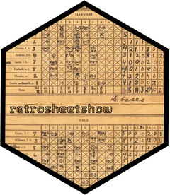

<!-- README.md is generated from README.Rmd. Please edit that file -->

```{r, include = FALSE}
knitr::opts_chunk$set(
  collapse = TRUE,
  comment = "#>",
  fig.path = "man/figures/README-",
  out.width = "100%",
  message = FALSE,
  warning = FALSE
)
```

# retrosheetshow <a href="https://tgerke.github.io/retrosheetshow"></a>

<!-- badges: start -->
[](https://lifecycle.r-lib.org/articles/stages.html#experimental)
[](https://github.com/tgerke/retrosheetshow/actions/workflows/R-CMD-check.yaml)
[](https://app.codecov.io/gh/tgerke/retrosheetshow?branch=main)
[](https://opensource.org/licenses/MIT)
<!-- badges: end -->

> **RETROSHEET DATA NOTICE**
>
> The information used here was obtained free of charge from and is copyrighted by Retrosheet. Interested parties may contact Retrosheet at 20 Sunset Rd., Newark, DE 19711.
>
> Website: https://www.retrosheet.org

**retrosheetshow** provides a convenient and tidy interface for accessing [Retrosheet](https://www.retrosheet.org) baseball data in R. The package follows tidyverse principles, making it easy to integrate Retrosheet's play-by-play event files, game logs, rosters, and schedules into your data analysis workflows.

## Installation

You can install the development version of retrosheetshow from GitHub:

```{r, eval = FALSE}
# install.packages("remotes")
remotes::install_github("tgerke/retrosheetshow")
```

## Basic Usage

### Play-by-Play Events

```{r}
library(retrosheetshow)
library(dplyr)

# See what's available
list_events(year = 2020:2024)
```

```{r}
# Download and parse event files (cached after the first download)
events <- get_events(year = 2024, type = "post")

# One row per game with all metadata
games <- get_game_info(events)
games
```

```{r}
# One row per play
plays <- get_plays(events)
plays
```

```{r}
# Interpret the event notation: event types, batting flags, outs, runs, RBI
parsed <- parse_plays(plays)
parsed |>
  count(event_type, sort = TRUE)
```

```{r}
# Or go straight to full game state: outs, runners, and score before
# every play (the foundation for run expectancy and leverage)
states <- track_game_state(events)
states
```

### Game Logs, Rosters, and Schedules

```{r}
# Game logs: one row per game with 161 summary fields.
# Scores and counting stats are integers, ready for analysis:
gamelogs <- get_gamelogs(year = 2024)
gamelogs |>
  summarize(home_win_pct = mean(home_score > visiting_score))
```

```{r}
# Team rosters by year
get_rosters(year = 2024, team = "NYA")
```

```{r}
# Season schedules, including postponements and makeup dates
schedule <- get_schedules(year = 2024)
schedule |> filter(!is.na(postponed))
```

### Reference Data

```{r}
parks <- get_park_ids()     # ballpark codes and locations
teams <- get_team_ids(2024) # team codes for a season
players <- get_player_ids() # player biographical database

parks |> filter(grepl("Fenway", name))
```

## Workflow Example

A complete workflow to analyze recent World Series games:

```{r}
# Get recent post-season data
postseason <- list_events(year = 2020:2024, type = "post") |>
  get_events()

# World Series games are played at the two pennant winners' parks in
# late October; the gametype info record identifies them directly
games <- get_game_info(postseason)
world_series <- games |> filter(gametype == "worldseries")

# Home run leaders across five World Series, from the raw play-by-play
get_plays(postseason) |>
  semi_join(world_series, by = "game_id") |>
  parse_plays() |>
  filter(event_type == "home_run") |>
  count(player_id, sort = TRUE) |>
  left_join(
    get_player_ids() |> select(player_id, first_name, last_name),
    by = "player_id"
  )
```

## Data Types

### Play-by-Play Events

Detailed play-by-play data (the core of Retrosheet). Event files contain several types of records, which `get_events()` reads into a tidy tibble and `parse_event_records()` / `get_plays()` / `get_game_info()` interpret. `parse_plays()` then turns the play notation itself into typed columns (event type, batting statistics, outs, runs, RBI, runner advancement), and `track_game_state()` attaches the pre-play situation (outs, runner identities, score) by replaying each game. Both are validated against Chadwick's `cwevent`:

- **`id`**: Game identifier
- **`info`**: Game metadata (date, teams, site, attendance, ...)
- **`start`** / **`sub`**: Starting lineups and substitutions
- **`play`**: Play-by-play events (the heart of the data)
- **`com`**: Comments
- **`data`**: Earned run data

See the [Retrosheet Format Reference](https://tgerke.github.io/retrosheetshow/articles/RETROSHEET_FORMAT.html) article for the notation.

### Game Logs

Summary statistics for each game (one row per game, 161 fields): team statistics, pitcher decisions, starting lineups, umpires, attendance, and more. Much smaller and faster than event files.

### Rosters and Schedules

Team rosters by year (names, IDs, bats/throws, position) and season schedules (dates, teams, day/night, postponements with makeup dates).

## Caching

Downloads are cached across R sessions under `tools::R_user_dir("retrosheetshow", "cache")`, so only the first call for a given file touches the network:

```{r, eval = FALSE}
cache_status() # view cached files
clear_cache()  # remove them
use_cache(FALSE) # disable for this session
```

## Data Coverage

Retrosheet has digitized data spanning over a century:

- **Regular season events**: 1911 onward
- **All-Star games**: 1933 onward (no game in 1945 or 2020)
- **Post-season**: 1903 onward (no World Series in 1904 or 1994)
- **Game logs**: 1871 onward
- **Schedules**: 1877 onward

See the [Retrosheet website](https://www.retrosheet.org/game.htm) for complete details on data availability.

## Retrosheet Attribution

**This package uses Retrosheet data.** Per Retrosheet's requirements, this notice must appear prominently:

> The information used here was obtained free of charge from and is copyrighted by Retrosheet. Interested parties may contact Retrosheet at 20 Sunset Rd., Newark, DE 19711.

Retrosheet is an all-volunteer 501(c)(3) charitable organization. To support their work, visit [retrosheet.org](https://www.retrosheet.org) or [donate](https://www.retrosheet.org/donate/index.html).

The retrosheetshow package is not affiliated with Retrosheet but is grateful for their work in preserving baseball history.

## Related Resources

### Retrosheet Documentation

- [Retrosheet home](https://www.retrosheet.org)
- [Event file documentation](https://www.retrosheet.org/eventfile.htm)
- [Game log field descriptions](https://www.retrosheet.org/gamelogs/glfields.txt)

### Related Baseball Data Packages

**R Packages:**

- [**Lahman**](https://cdalzell.github.io/Lahman/) - R package for Sean Lahman's Baseball Database with historical player and team statistics
- [**baseballr**](https://billpetti.github.io/baseballr/) - Functions for scraping and analyzing baseball data from FanGraphs, Baseball Reference, and Statcast
- [**mlbgameday**](https://github.com/keberwein/mlbgameday) - R package for accessing MLB GameDay data

**Python Packages:**

- [**pybaseball**](https://github.com/jldbc/pybaseball) - Python package for baseball data analysis with Statcast, FanGraphs, and Baseball Reference scrapers
- [**collegebaseball**](https://github.com/nathanblumenfeld/collegebaseball) - Python tools for college baseball data

## License

MIT + file LICENSE
